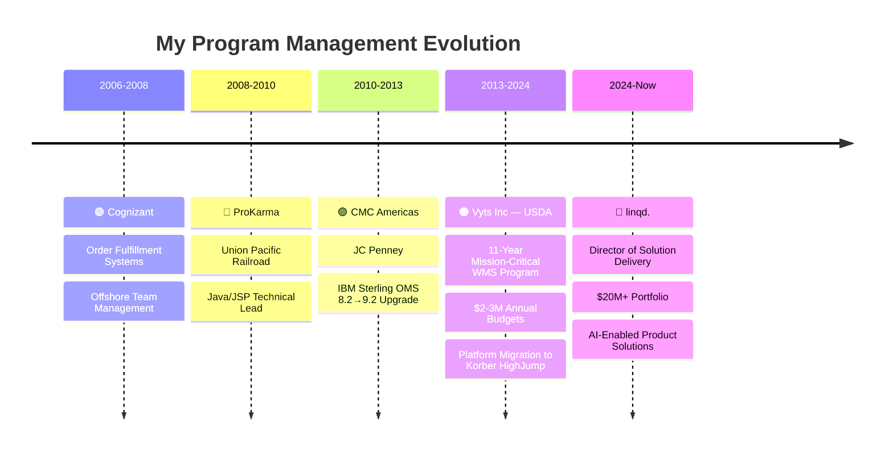

<!--
**akanshacprofile/akanshacprofile** is a ✨ _special_ ✨ repository because its `README.md` (this file) appears on your GitHub profile.
-->
<div align="center">

<!-- 
  ⚠️ If capsule-render starts working again, replace the header below with:
  
-->

<!-- Header using readme-typing-svg (always works) -->


</div>

<p align="center">
  <a href="https://www.linkedin.com/in/chauhanakansha"></a>
  <a href="mailto:akanshacprofile@gmail.com"></a>
  
</p>

---

##  Who Am I?

<table>
<tr>
<td width="55%" valign="top">


<br><br>

**15+ years** turning complex, cross-functional technology programs into on-time, on-budget delivery — from **$22M portfolios** to **40-client platform migrations** to **AI-driven product launches**.

Now on a deliberate mission to merge **enterprise delivery discipline** with **cutting-edge AI/ML** — because the hardest part of AI isn't the technology, it's the execution. And execution is what I do.

</td>
<td width="45%" align="center">

<!-- Woman working at a desk with laptop — confirmed female illustration -->


</td>
</tr>
</table>

<!-- Colorful quick-fact cards -->
<div align="center">

<table>
<tr>
<td align="center" width="25%">

<br><b>SUPERPOWERS</b>
<br><sub>Turning chaos into<br>structured delivery</sub>
</td>
<td align="center" width="25%">

<br><b>ASK ME ABOUT</b>
<br><sub>Program management,<br>AI strategy, Agile at scale</sub>
</td>
<td align="center" width="25%">

<br><b>CURRENTLY LEARNING</b>
<br><sub>RAG, LangChain,<br>Agentic AI workflows</sub>
</td>
<td align="center" width="25%">

<br><b>2026 GOAL</b>
<br><sub>Lead enterprise AI/ML<br>programs at scale</sub>
</td>
</tr>
</table>

</div>

<!-- Fun facts as colorful badges -->
<div align="center">

### 💡 Fun Facts


<br>

<br>

<br>


</div>

<br>

## 🏆 By the Numbers

<div align="center">


</div>

<table>
<tr>
<td width="50%" valign="top">

### 🚀 What I Deliver
- Enterprise programs up to **$22M** in portfolio value
- Teams of **25+ engineers** across concurrent workstreams
- **98% client satisfaction** and **99% delivery accuracy**
- **20% faster** delivery through Agile execution
- RFQs/SOWs with a **95% win rate**

</td>
<td width="50%" valign="top">

### 💡 How I Optimize
- **50% cost savings** through strategic platform migration
- **$750K saved annually** through process optimization
- **32% fewer** code conflicts via SonarQube governance
- **30% reduction** in post-implementation issues
- **25% improvement** in reporting data accuracy

</td>
</tr>
</table>

<br>

##  My AI Journey

<div align="center">

```
 ╔══════════════════════════════════════════════════════════════════╗
 ║  🧠  Enterprise Program Delivery  ──→  AI Program Leadership   ║
 ╚══════════════════════════════════════════════════════════════════╝
```


</div>

<br>

<div align="center">

| | What | Details |
|:---:|:---|:---|
| 🎓 | **PGP in AI for Leaders** | UT Austin — LLMs, NLP, AI strategy, deep learning |
| 📜 | **AI Certifications** | PMI — GenAI Overview (2024) + Prompt Engineering (2026) |
| 🔬 | **Hands-On Building** | RAG pipelines with LangChain, vector databases (FAISS, Pinecone), LLM fine-tuning (LoRA) |
| 🏭 | **Production AI** | AI-enabled solutions at linqd. — ML models, scoring, analytics, CRM automation |
| 📚 | **Studying Now** | Agentic AI workflows, MLOps, LLM evaluation, GPU cost optimization |

</div>

<br>

##  Career Timeline



<br>

## 🛠️ Tech & Tools

<div align="center">

#### ☁️ Cloud & Infrastructure


#### 🤖 AI/ML *(Learning & Building)*


#### 📋 Program & Delivery Management


#### 💻 Development & Data


</div>

<br>

## 📜 Certifications

<div align="center">

| | Year | Certification | Issuer |
|:---:|:---:|:---|:---|
| 🤖 | 2026 | Prompt Engineering for Project Managers | PMI |
| 🧠 | 2024 | Generative AI Overview for Project Managers | PMI |
| ⚡ | 2023 | Agile Project Management | — |
| 🏅 | 2023 | Professional Scrum Master™ I (PSM I) | Scrum.org |
| 🎓 | *In Progress* | PGP in Artificial Intelligence for Leaders | UT Austin |

</div>

<br>

## 🔭 What I'm Up To Right Now

<div align="center">

| | Focus | What's Happening |
|:---:|:---|:---|
| 📚 | **Studying** | RAG architectures, Agentic AI workflows, Vector databases |
| 🔧 | **Building** | LLM-powered tools using LangChain & Python |
| 📊 | **Exploring** | MLOps, LLM evaluation frameworks, GPU cost optimization |
| 🎯 | **Goal** | Lead enterprise AI/ML program delivery at scale |

</div>

<br>

<div align="center">

> *"Every technical domain I've entered — IBM Sterling, Oracle Cloud, Azure, AI/ML —*
> *I've mastered through immersion. AI is the next chapter."* ✨

</div>

<br>

## 📊 GitHub Activity

<p align="center">
  
  
</p>

<p align="center">
  
</p>

<!-- Trophies -->
<p align="center">
  <a href="https://github.com/ryo-ma/github-profile-trophy">
    
  </a>
</p>

<!-- Activity graph -->
<p align="center">
  
</p>

---

<div align="center">

### 🤝 Let's Connect & Collaborate

**Open to collaboration on AI/ML projects, enterprise delivery tools, and program management automation.**

<br>

<a href="https://www.linkedin.com/in/chauhanakansha"></a>
<a href="mailto:akanshacprofile@gmail.com"></a>

</div>


